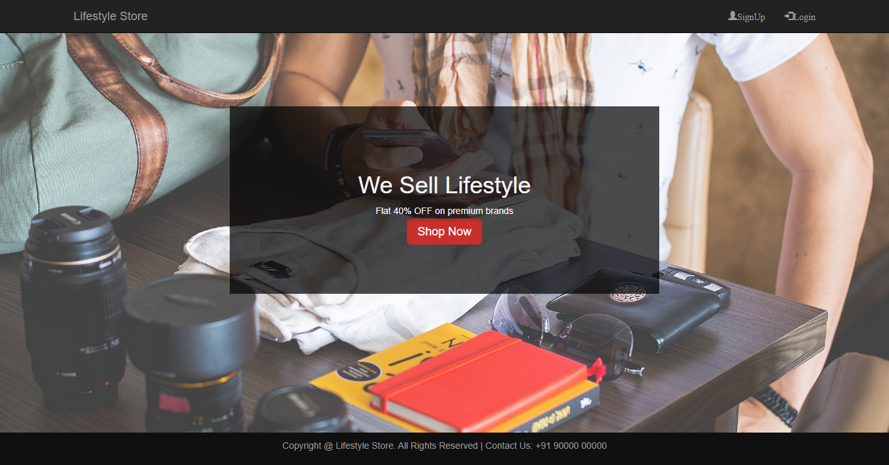
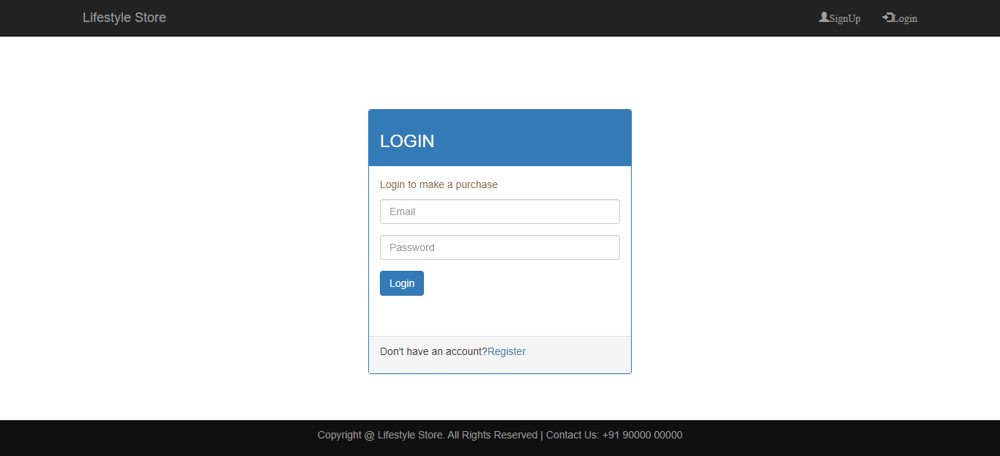
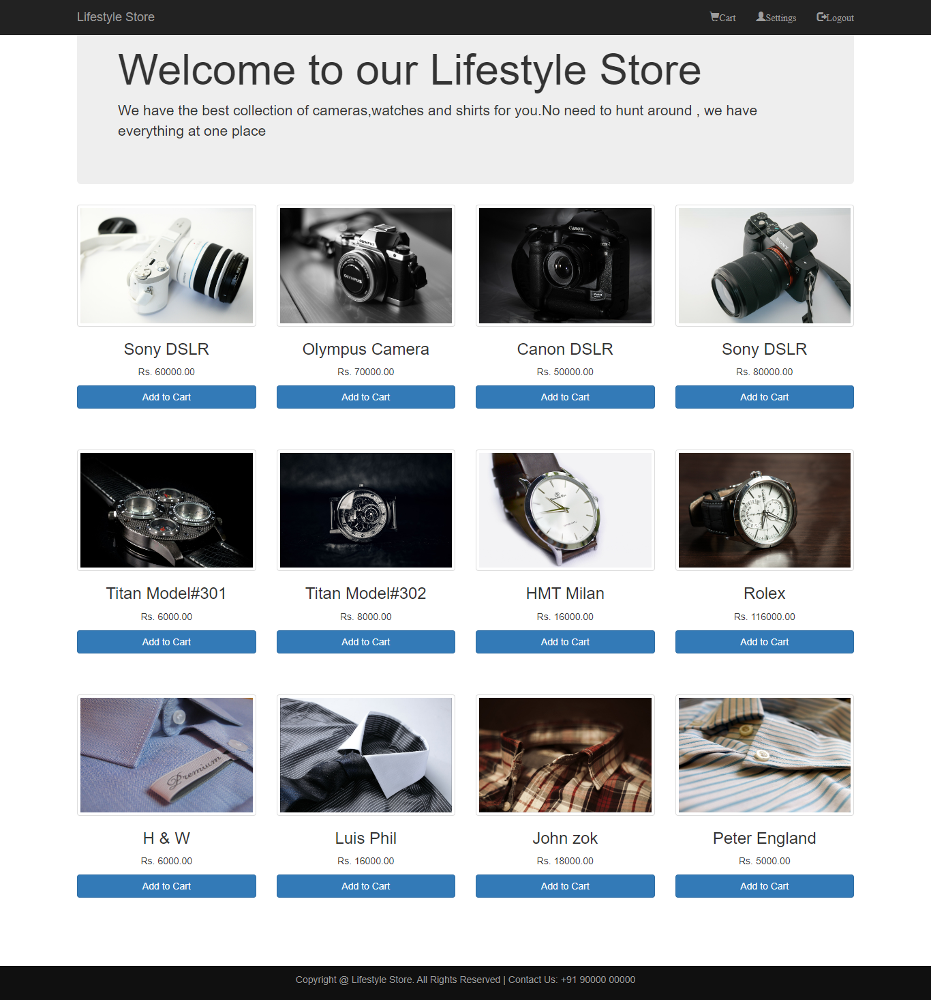
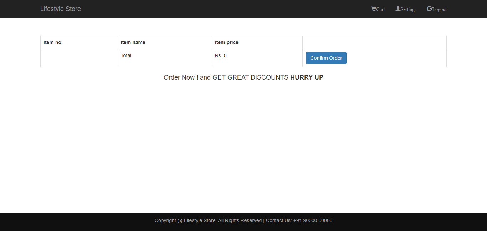
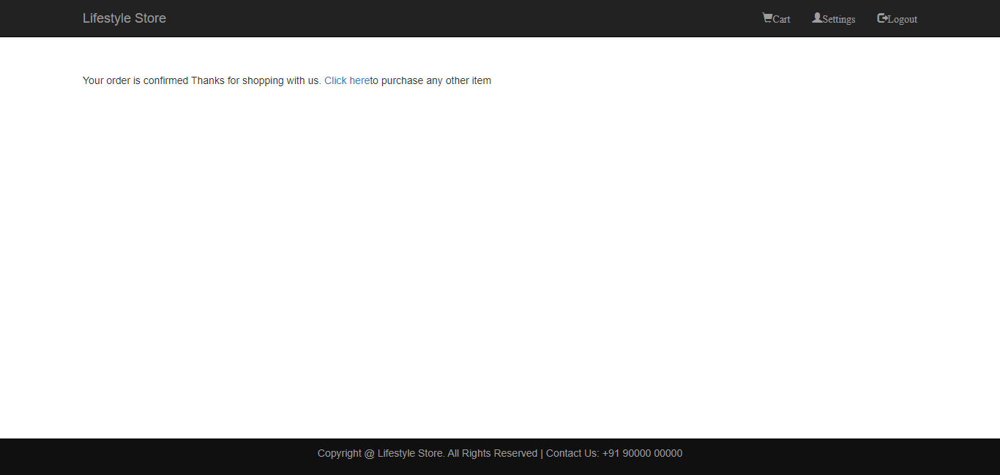
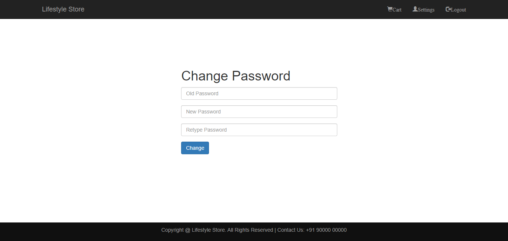

# LifeStyle Store Website

***
## Description

This project [LifeStyle Store Website](https://lifestyle-bootstrap.netlify.app/)[Front-end] is a collection of various webpages for an e-commerce store and was built using Semantic HTML, CSS and **Bootstrap** from scratch. This project has various webpages including Home page, product page, cart page, settings page and so on.  This was a simple & fun-project to build while learning about bootstrap and using it's components in projects.

***

### Links for Project

* <a href="https://lifestyle-bootstrap.netlify.app/" target="_blank">Live Project Link</a>

* [Youtube Video Demo](https://youtu.be/MvtEKU2GGhw)

* [Source Code](https://github.com/ShubhamSingh03/LifeStyle-Store-Website)

***
### Built With 

* Semantic HTML
* Bootstrap

***

### Key Learnings

* Learned to create multiple pages for the same websites and link them(front-end)
* Learned to read [Bootstrap Docs](https://getbootstrap.com/docs/4.1/getting-started/introduction/) more efficiently
* Used Bootstrap components when necessary

***

### Time Taken to finish this project
 

>10 hours to build it from scratch(responsive design).

 

***

### Screencaptures of Project

 

  1. ### Home Page

   

  

   

  2. ### Login Page

 

 

  3. ### Product Page 

   

  

   

  4. ### Cart Page

  

   

  4. ### Success Page
 
   

  

   
   
   5. ### Settings Page

    

  

   

***
 

### Checkout Portfolio & Other Projects

#### [Personal Portfolio](https://shubhambhoj.in/)

#### [Findcoder Profile](https://www.findcoder.io/u/shubham_singh)
***

### Connect with Me
* [Mailto](mailto:shubhambhoj3@gmail.com)
* [LinkedIn](https://www.linkedin.com/in/shubham-singh-b122b7171/)
* [Github](https://github.com/ShubhamSingh03)
* [Findcoder](https://www.findcoder.io/u/shubham_singh)
***
***
[go to top](#lifestyle-store-website)